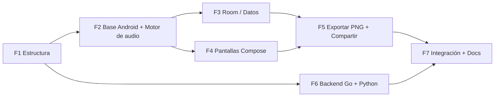

# 🗺️ PLAN MAESTRO — AudioCheck

Documento oficial de fases del proyecto. Cada fase termina con un **commit en `main`** (vía Pull Request).

---

## ✅ Fase 1 — Estructura del repositorio
- Carpetas `mobile-android/`, `backend-go/`, `analysis-python/`, `docs/`.
- `.gitignore` raíz, `README.md`, Plan Maestro, reparto de tareas y contratos.

## Fase 2 — Base Android + Motor de audio (Core)
**2A. Configuración base (¡primero de todo, en `main`!)**
- Renombrar app a **AudioCheck**, package `com.audiocheck.app`, `minSdk 26`.
- Agregar dependencias: Jetpack Compose, Material 3, Navigation Compose, Hilt, Room, DataStore, Coroutines.
- Crear carpetas de paquetes: `core/`, `data/`, `domain/`, `ui/`.

**2B. Motor**
- `WiredAudioMonitor.kt`: detecta solo audífonos cableados/USB; rechaza Bluetooth y altavoz.
- `AudioRouteValidator.kt`: verifica la ruta real de salida (`routedDevice`).
- `ToneEngine` / `AndroidToneEngine.kt`: tonos senoidales PCM float, 48 kHz, estéreo, oído L/R, fade-in/out.
- `CalibrationProfile.kt` + `DemoCalibrationProfile` (niveles internos, sin dB HL).
- `HearingTestEngine` + `ThresholdStrategy` / `DemoThresholdStrategy`.
- `FakeToneEngine` y `FakeWiredAudioMonitor` (solo debug/tests).

## Fase 3 — Base de datos Room y capa de datos
- Entidades: `TestSessionEntity`, `TonePresentationEntity`, `AudiogramPointEntity`, `CalibrationProfileEntity`.
- DAOs, repositorios, mappers, use cases.
- `SyncRepository` → `LocalOnlySyncRepository` (Local First).

## Fase 4 — Pantallas en Jetpack Compose
- Tema Material 3 (indigo `#615FFF`, dark mode).
- Navegación: Splash → Home → HeadphoneCheck → Instructions → HearingTest → Results; Home → History; Settings.
- `AudiogramChart` con Canvas (O = derecho, X = izquierdo).
- ViewModels con `StateFlow`. Textos en `strings.xml`.

## Fase 5 — Exportación PNG y compartir
- `AudiogramExporter` (1600×1200 px en `cacheDir`).
- `FileProvider` + `Intent.ACTION_SEND` + Sharesheet.

## Fase 6 — Backend Go + Análisis Python
- **Go:** `GET /health`, `POST/GET /api/v1/sessions`, `GET /api/v1/sessions/{id}`, `POST /api/v1/sessions/{id}/results`, `GET /api/v1/calibration-profiles/{id}`.
- **Python (FastAPI):** análisis orientativo de resultados, estadísticas y reportes.
- Docker / docker-compose.

## Fase 7 — Integración, tests y documentación
- Tests unitarios (estrategia, estados, repositorios, ViewModels).
- `gradlew assembleDebug`, `test`, `lint` sin errores.
- `docs/ARCHITECTURE.md`, `AUDIO_ENGINE.md`, `CALIBRATION.md`, `TEST_FLOW.md`.

---

## 🚫 Reglas que no se rompen
- Nunca reproducir tonos por el altavoz ni por Bluetooth.
- Nunca afirmar diagnósticos ("tienes pérdida auditiva", etc.). Siempre "Resultado orientativo".
- Nunca mostrar dB HL sin calibración real.
- La app funciona 100% sin Internet.
- Release nunca usa `FakeToneEngine` ni permite saltarse la verificación de audífonos.
